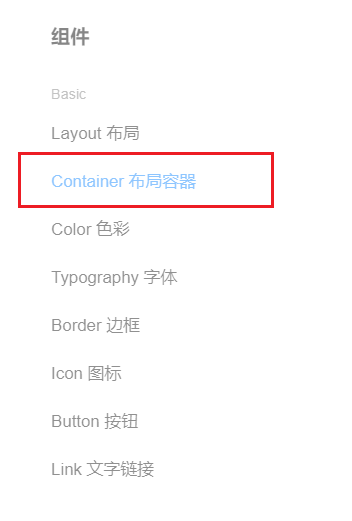
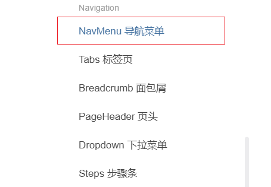
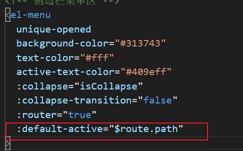
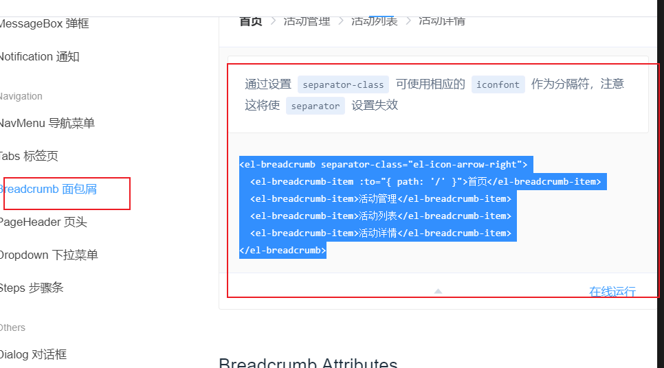
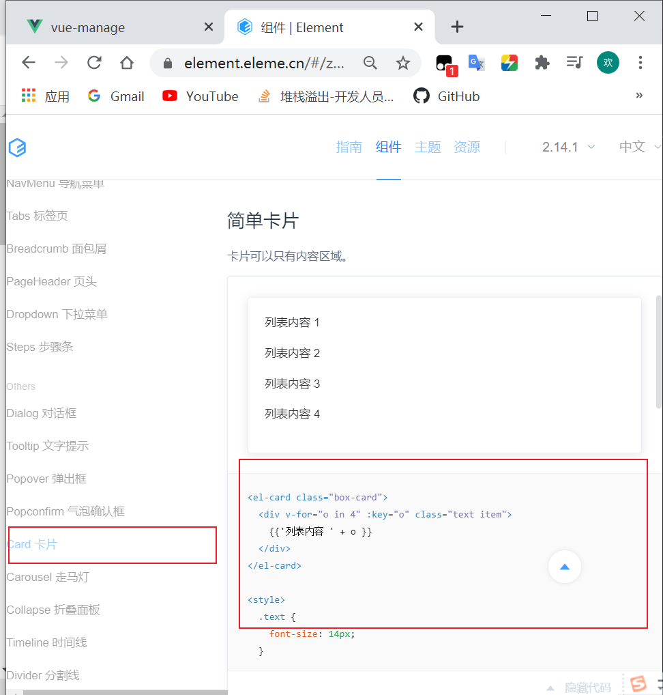
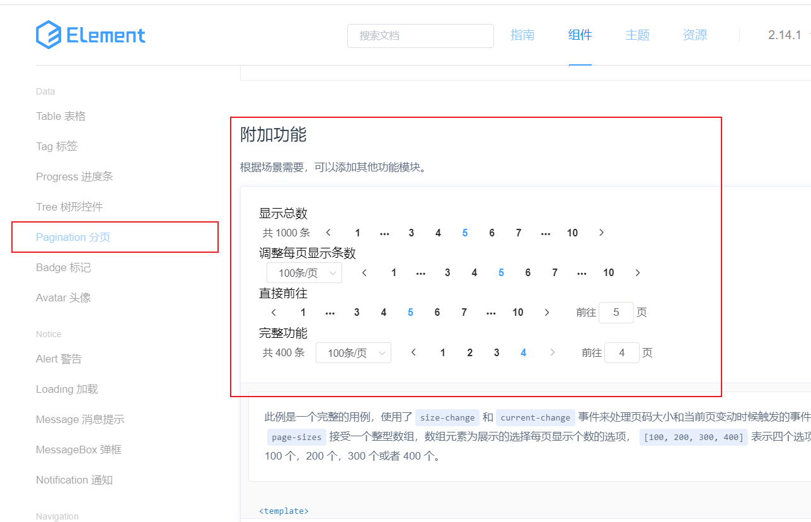
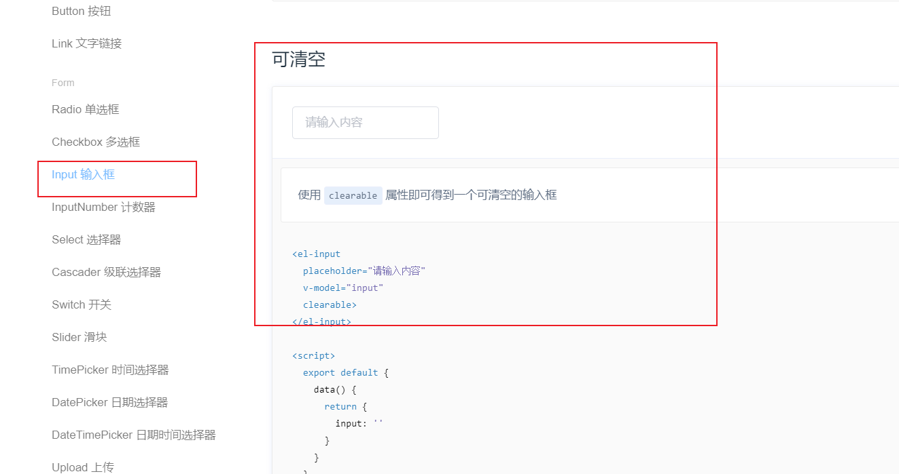
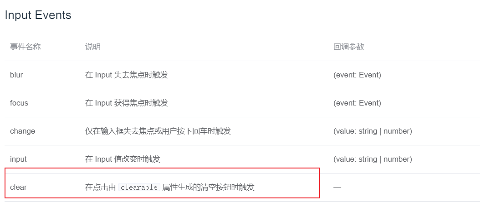
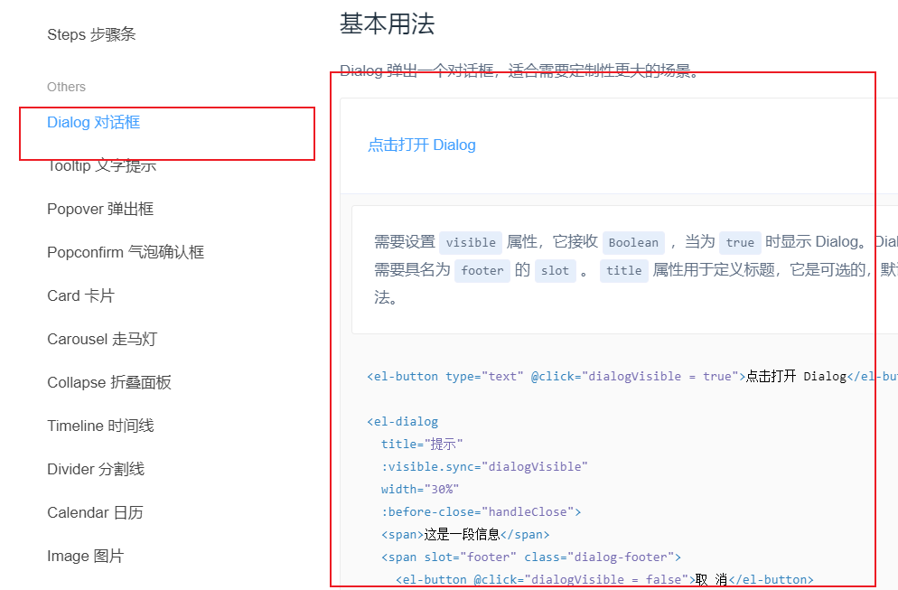

# 电商管理系统主页

## 1 主页布局

### 1.1 布局容器的选择

这里我们选择ElementUI中的布局容器



复制代码即可。

### 1.2 实现导航菜单的基本结构



### 1.3 通过接口获取菜单数据

通过axios拦截器添加token验证，保证拥有获取数据的权限。

main.js

```js
//axios请求拦截
axios.interceptors.request.use(config => {
  // console.log(config);
  config.headers.Authorization = window.sessionStorage.getItem('token');
  return config
})
```

在Home.vue中调用Vue生命周期提供的钩子函数created

```js
export default {
  name: "Home",
  data() {
    return {
      menuList: []
    };
  },
  methods: {
    logout() {
      window.sessionStorage.clear();
      this.$router.push("/login");
    },
    async getMunuList() {
      //发送请求
      const { data: res } = await this.$http.get("menus");
      console.log(res);
      if (res.meta.status !== 200) return this.$messgae.error(res.meta.msg);
      this.menuList = res.data;
    }
  },
  created() {
    this.getMunuList();
  }
};
</script>
```

通过两层for循环渲染数据

### 1.4 添加导航分类图标

使用字体图标，创建iconList对象，以键值对形式存储，键为当前导航条的id，值为icon的font-class类。

```js
data() {
    return {
        menuList: [],
        iconList: {
            "125": "icon-ziyuan",
            "103": "icon-suo",
            "101": "icon-shangpinchuangjian",
            "102": "icon-danju",
            "145": "icon-baobiao"
        }
    };
},
```

```html
<i class="iconfont" :class="iconList[item.id]"></i>
```

### 1.5 每次只能打开一个菜单项

给menu添加unique-opened属性，true为只能开一项，false为无数项

### 1.6 实现侧边栏的折叠展开效果

- menu的collapse属性，true折叠，false展开，通过动态绑定Boolean实现。

- :collapse-transition="false"取消动画效果

- 动态生成侧边栏宽度

  ```html
  <el-aside :width="isCollapse?'64px': '200px'">
  ```

### 1.7 首页路由的重定向和路由链接改造

```js
{
    path: '/home',
        component: Home,
            children: [
                { path: "", redirect: '/welcome' },
                { path: "/welcome", component: Welcome }
            ]
}
```

使用Menu的router属性，true启动路由跳转，index设置为item.path作为跳转地址，需要手动添加"/"


```html
 <el-menu-item :index="'/'+item2.path" v-for="item2 in item.children" :key="item2.id">
```

### 1.8 通过路由的形式展示用户列表组件

### 1.9 保存左侧菜单激活状态



### 1.10 绘制用户列表组件的基本结构布局

头部为面包屑导航区域



卡片视图



### 1.11 获取用户列表数据

定义查询条件和本地数据

```js
data() {
    return {
        queryInfo: {
            query: "",
            pagenum: 3,
            pagesize: 2
        },
        userList: []
    };
},
methods: {
    async getUserList() {
        const { data: res } = await this.$http.get("roles", {
            params: this.queryInfo
        });
        console.log(res);
        if (res.meta.status !== 200)
            return this.$message.error("获取用户列表失败");
        this.userList = res.data;
    }
}
```

### 1.12 渲染用户列表

使用Table

```html
<!-- 用户列表区域 -->
<el-table :data="userList" style="width: 100%" stripe>
    <el-table-column prop="roleName" label="职务" width="180"></el-table-column>
    <el-table-column prop="roleDesc" label="职务描述" width="180"></el-table-column>
</el-table>
```

**添加索引列**

```html
<el-table-column type="index" label="#" width="180"></el-table-column>
```

**自定义状态列显示**

使用作用域插槽，scope.row获取当前行的数据

```html
<el-table-column label="状态" width="180">
    <template v-slot="scope">
        <el-switch v-model="scope.row.mg_state" active-color="#13ce66" inactive-color="#ff4949"></el-switch>
    </template>
</el-table-column>
```

**操作列显示**

使用button，并使用文字提示，当用户停留在setting时，显示提示文字

```html
 <!-- 分配权限按钮 -->
<el-tooltip effect="dark" content="设置用户权限" placement="top" :enterable="false">
    <el-button type="warning" icon="el-icon-setting" size="small"></el-button>
</el-tooltip>
```

### 1.13 实现分页效果

页面布局：



```html
<!-- 分页区域 -->
<el-pagination
               @size-change="handleSizeChange"
               @current-change="handleCurrentChange"
               :current-page="queryInfo.pagenum"
               :page-sizes="[1,2,5,10]"
               :page-size="queryInfo.pagesize"
               layout="total, sizes, prev, pager, next, jumper"
               :total="total"
               ></el-pagination>
```

- @size-change 每页显示记录条数变化触发事件
- @current-change 当前页变化触发事件
- :current-page 当前页 绑定请求参数
- :page-sizes 可选择的每页显示条数
- :page-size 当前显示条数 绑定请求参数
- layout分页布局显示 总条数、选择条数器等等.....
-  :total 总条数 绑定data数据

### 1.14 修改用户状态

步骤：

1. 监听状态
2. 状态改变时，发出请求，改变状态
3. 更新失败，提示用户，状态取反；更新成功，提示用户。

```html
<el-table-column label="状态" width="160">
    <template v-slot="scope">
        <el-switch
                   v-model="scope.row.mg_state"
                   active-color="#13ce66"
                   @change="userStateChange(scope.row)"
                   ></el-switch>
    </template>
</el-table-column>
```

```js
async userStateChange(userinfo) {
    console.log(userinfo);
    const { data: res } = await this.$http.put(
        `users/${userinfo.id}/state/${userinfo.mg_state}`
    );
    if (res.meta.status !== 200) {
        return this.$message.error("更新用户列表失败");
        this.userinfo.mg_state = !this.userinfo.mg_state;
    }
    this.$message.success("更新用户状态成功");
}
}
```

### 1.15 实现搜索功能

1. 搜索框双向绑定queryInfo.query查询参数
2. 搜索按钮的处理函数为getUserList

>这个方法是真的厉害，没想到

需求：在搜索框输入文字后，自动出现X 点击清空自动显示所有用户列表

使用以下，并给其绑定clear事件



clear的处理函数：

```js
clearSearch() {
    this.queryInfo.query = "";
    this.getUserList();
}
```

### 1.16 渲染添加用户的对话框



**渲染添加用户的表单**

内容与之前的表单验证类似

新增：自定义表单验证validator

```html
<el-form-item label="手机号" prop="phone">
    <el-input v-model="newUser.phone"></el-input>
</el-form-item>
```

```js
 phone: [{validator: validatorPhone,trigger: "blur"}],
```

```js
data() {
    var validatorPhone = (rule, value, callback) => {
        //手机号验证规则
        var reg = /^1[3|4|5|7|8][0-9]{9}$/;
        if (!reg.test(value)) {
            callback(new Error("手机号输入错误"));
        } else {
            callback();
        }
    };
    return {.....}
```

自定义表单验证步骤：

1. data中自定义一个箭头函数
2. 验证规则中使用该函数