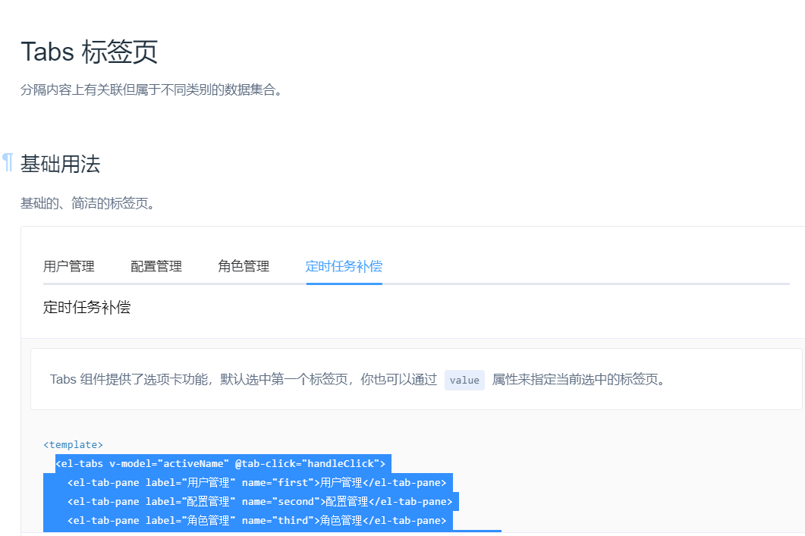
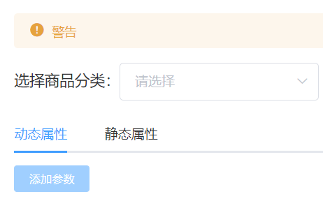

### 参数管理

## 1 参数管理概念


## 2 基本UI布局

略

## 3 获取商品分类列表数据并渲染至级联选择框

获取数据略，级联选择框与06类似。

## 4 Tab标签页的使用



```html
<!-- 标签页 -->
<el-tabs v-model="activeName" @tab-click="handleTabClick">
    <el-tab-pane label="动态属性" name="first">动态属性</el-tab-pane>
    <el-tab-pane label="静态属性" name="second">静态属性</el-tab-pane>
</el-tabs>
```

data:

```js
// 被激活的页签名称
activeName: "first"
```

### 禁用按钮



使用计算属性，当selectKeys长度>0时，btn disabled false。

## 5 分类参数

### 5.1 获取参数列表数据

```js
async getParams() {
    const { data: res } = await this.$http.get(
        `categories/${
        this.selectCateKeys[this.selectCateKeys.length - 1]
        }/attributes`,
        {
            params: {
                sel: this.activeName
            }
        }
    );
    console.log(res);
    if (res.meta.status !== 200) {
        return this.$message.error("获取分类参数失败");
    }
    this.paramsList = res.data;
}
```

### 5.2 获取到的参数数据挂载到不同数据源上

对获取到的数据进行判断，分别存入不同的数据中

```js
//动态
if (res.data.attr_sel === "many") this.manyTableData = res.data;
//静态
else this.onlyTableData = res.data;
```

使用Table表格渲染数据，略