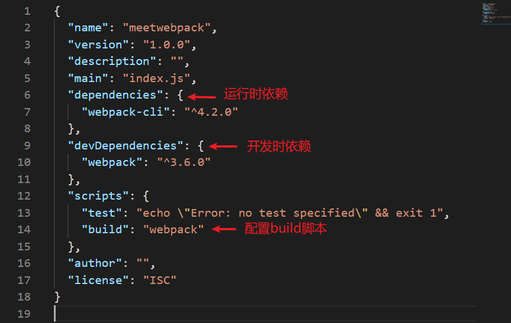
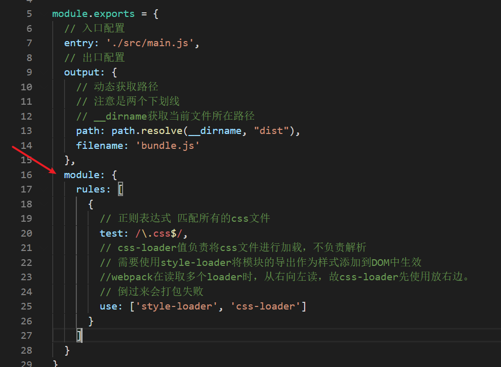

# Webpack

## Webpack起步

### 准备工作

**本地安装webpack**

webpakc依赖node.js，先下载node.js，再使用包管理工具npm下载webpack


**文件夹和文件夹解析**

- dist文件夹：存放打包后的文件
- src文件夹：存放写的源文件，包含js文件夹、css文件夹等。
  - main.js 入口文件 放在src的最外层，不要放在js文件夹里。功能相关东西放在js文件夹中。
- index.html 首页
- package.json 通过npm init生成


### js文件打包

在cmd中进入当前项目目录并执行以下命令：

```
npx webpack ./src/main.js ./dist/bundle.js
```

- 命令的意思：使用webpack工具将./src/main.js打包到 dist中的bundle.js中。webpack会自动处理模块之间的依赖，所以当webpack发现main.js依赖于mathUtil，会自动将其打包进去。
- 当内容发生改变的时候需要重新执行命令 重新打包
- 打包后在dist文件夹下会生成bundle.js文件。
- 将bundle.js引入index.html即可。


## Webpack的配置

进行文件打包时，需使用命令：webpack 入口 出口。我们可以将这俩参数写到配置中直接读取。	

- 创建一个webpack.config.js文件，进行入口、出口配置。

  ```js
  // 如果依赖于Node包则建package.json
  // package.json通过npm init生成
  const path = require('path');
  
  module.exports = {
    // 入口： 可以是字符串/数组/对象
    entry: './src/main.js',
    // 出口： 通常为对象 至少包含俩重要属性 path和filename
    output: {
      // 动态获取路径 
      // 注意是两个下划线  __dirname获取当前文件所在路径
      path: path.resolve(__dirname, "dist"),//path 通常为绝对路		径
      filename: 'bundle.js'
    },
  }
  ```

- 配置完上述之后，直接指令：webpack，即可打包，webpack工具会自动找到webpack.config.js。**此处webpack用的是全局webpack。**


一个项目往往依赖某个特定的webpack版本，使用全局webpack打包可能会出错，故一个项目里通常都有自己局部的webpack。

- 安装局部webpack

  ```npm
  npm install webpack@3.6.0 --save-dev  
  //3.6.0为版本号
  ```

- ~~通过node_modules/.bin/webpack使用局部webpack打包~~（一般不这样做）

  使用npm run build指令

  - 需要在package.json中scripts添加build属性，其属性值为执行的命令。

  - npm run build优先使用局部webpack，局部没有才回去全局环境变量找。

    


其他知识点：

1. 开发时依赖devDependencies: 开发时需要，打包完之后，把这个包放进服务器，不需要webpack了。   --save-dev
2. 运行时依赖dependencies:开发完之后还想用的东西放这里。  --save


## loader

开发过程中，需要加载css、图片、ES6转ES5等，而webpack本身的能力不支持紫红色鞋转化，需要给webpack扩展对应的loader。


**使用过程**

1. npm 安装对应的loader。参考：[webpack](https://www.webpackjs.com/loaders/)
2. 在webpack.config.js中的module下配置




###  css文件处理

#### 准备工作

- 在入口文件中引用css文件

```js
// 依赖css文件
require("./css/normal.css")
```

- 配置css-loader，包括安装css-loader及webpack.config.js中的module属性配置。
  - 注意：
    1. 使用css-loader的同时需要配合使用style-loader，因为css-loader只负责加载css文件不负责解析，而style-loader负责将样式添加至DOM中生效。
    2. use中，style-loader需放在css-loader后，因为webpack读取loader的顺序是从右向左的顺序读取的。
- 重新打包


```拓展
以下错误是由于css-loader版本过高造成，将css-loader版本与webpack版本设置一致即可。
UnhandledPromiseRejectionWarning: TypeError: this.getResolve is not a function

```


### less文件处理

#### 准备工作

- 在入口文件依赖less文件
- 配置less-loader，包括下载和webpack.config.js文件配置
  - 注意：增加loader是在rules中追加对象，而不是覆盖。
- 重新打包 npm run build


```
1、npm安装报错npm ERR! Refusing to install package with name "xxxx" under a packagexxxx
原因：package.json下的name字段与安装package名字撞了
解决方案：检查package.json，修改name字段。

2、Module build failed: Error: Cannot find module 'less'
原因：安装是缺少less解析。
解决方案：npm install --save-dev less-loader@4.1.0 less@3.9.0

3、 UnhandledPromiseRejectionWarning: TypeError: loaderContext.getResolve is not a function
原因：less-loader版本过高，与webpack不对应
解决方案：npm install --save-dev less-loader@版本号 less@版本号 自行查询webpack对应的版本号

```


### 图片文件处理

#### 准备工作

- css样式用引用图片

- 安装本地url-loader并配置

  ```
  {
          test: /\.(png|jpg|gif)$/,
          use: [
            {
              loader: 'url-loader',
              options: {
              
                limit: 10000
              }
            }
          ]
        }
  ```

  - 1、当加载图片小于limit时，会将图片编译成base64字符串形式
  - 2、 如果加载图片大于Limit,需要安装file-loader(不用配置) 安装@3.0.1版本
    给用户展示的时候 需要展示的是打包的图片 即路径为dist/xxxx图片，**此时要在output中增加 publicPath: './dist/'**
  - 一般开发中 limit值为8192 即8kb

- 重新打包


#### 图片文件处理 — 修改文件名称

- webpack自动帮助我们生成一个32位hash值作为图片的名字

- 实际开发中，需要对图片名字、位置有所要求，需要在options中添加：

  ```
  {
          test: /\.(png|jpg|gif)$/,
          use: [
            {
              loader: 'url-loader',
              options: {
                limit: 10000,
                // name、hash、ext都是变量，所以放在[]里
                name: 'img/[name].[hash:8].[ext]'
              }
            }
          ]
        }
  ```

  - img：文件要打包到的文件
  - name：图片原名字
  - hash:8：保留8位hash值
  - ext：使用图片原来的扩展名


### ES6语法处理

将ES6转成ES5，需要使用babel

- 安装babel对应的loader

```
npm install --save-dev babel-loader@7 babel-core babel-preset-es2015
```

- 配置webpack.config.js文件

  ```
  {
          test: /\.js$/,
          exclude: /(node_modules|bower_components)/,
          use: {
            loader: 'babel-loader',
            options: {
              presets: ['es2015']
            }
          }
        }
  ```

- 重新打包


## webpack配置Vue

#### 准备工作

- main.js添加引用 并创建Vue实例

  ``` 
  import Vue from "vue"
  ```

- 安装vue。因为项目运行时需要使用Vue，所有不是开发时依赖，需使用--save  而不是--save-dev

  ```
  npm install vue --save
  ```

  此时重新打包console会报错：

  [Vue warn]: You are using the runtime-only build of Vue where the template compiler is not available.

  Either pre - compile the templates into render functions, or use the compiler - included build.

  - 原因：

    Vue在构建最终的发布版本时，构建了两类版本

    -  1、runtime - only 代码中不可以有任何的template
    -  2、runtime -compiler 代码中可以有template 因为compiler可以用于编译template

    当前默认使用的是runtime-only版本，想要编译template，但是不支持，所以报错。

  - 解决方法：指定runtime-compiler进行编译

    - 修改webpack.config.js配置，添加resolve属性。

      ```
      module.exports = {
        entry: './src/main.js',
        output: {...},
        module: {...},
        resolve: {
          //alias:别名
          alias: {
            'vue$': 'vue/dist/vue.esm.js'
          }
        }
      }
      ```

    - import Vue from "vue"的逻辑：

      - 寻找vue有没有指向一个具体的文件夹
        - 有，则使用指定的
        - 没有，则使用node_modules默认的，vue.runtime.js

- 重新打包即可运行成功。


### el和template区别

- el用于挂载要管理的元素，让Vue实例可以管理它其中的内容。
- 如果Vue实例中指定了template，则template模板中的内容会替换掉挂载的对应el的模板。
- 优点：
  - 在以后的开发中再次操作index.html，只需要在template中写入对应的标签即可，不需要手动频繁修改html模板。


### Vue组件化开发

#### .vue文件封装处理

- 创建一个vue文件，其模板如下，template放模板，script放脚本，style放样式，实现模板与js代码分离

  ```
  <template>
  
  </template>
  
  <script>
  export default {
    name: "",
    data() {
      return {
      };
    },
    methods: {
    }
  };
  </script>
  
  <style scoped>
  
  </style>
  ```

- main.js添加引用

- 安装vue-loader 和 vue-template-compiler，并在webpack.config.js进行配置

  ```
  npm install vue-loader vue-template-compiler --save-dev
  
  //配置文件
  {
     test: /\.vue$/,
     use: ['vue-loader']
  }
  ```

  - 此时报错：vue-loader was used without the corresponding plugin. Make sure to include VueLoaderPlugin in your webpack config.

    原因：vue-loader 15版本以上，需要使用plugin

    解决方案：

    ```
    // webpack.config.js中添加
    const VueLoaderPlugin = require('vue-loader/lib/plugin')
    
    module.exports = {
      // ...
      plugins: [
        new VueLoaderPlugin()
      ]
    }
    ```

    


## Plugin插件

### 1、认识Plugin

- 什么是plugin
  - Plugin对某个现有的架构进行扩展
  - webpack中的插件，是对webp ack现有功能的扩展。
- loader和plugin的区别
  - loader主要用于转换某些类型的模块，转换器。
  - plugin对webpack功能的扩展，扩展器。
- plugin使用过程
  - npm安装
  - 在webpack.config.js中的plugins中配置插件。

### 2、常用的plugin插件

#### (1) 添加版权的Plugin：BannerPlugin

- BannerPlugin为webpack自带的plugin

- 使用方法，在webpack.config.js中进行配置。

  ```
  //获取已安装的webpack
  const webpack = require('webpack');
  
  module.exports = {
    ...//
    plugins: [
      new webpack.BannerPlugin("最终版权归ruoruochen所有")
    ]
  }
  ```

  

#### （2）打包html的Plugin：HtmlWebpackPlugin

- HtmlWebpackPlugin的功能

  - 自动生成一个Index.html文件 (可指定模板生成)
  - 将打包的js文件自动通过script标签插入body中。

- 使用流程

  - 1、安装HtmlWebpackPlugin插件

    ```
    npm install html-webpack-plugin@3.2.0 --save-dev
    ```

    

  - 2、修改webpack.config.js中的配置，其中template设置根据什么模板生成index.html。

    - 因为index.html已打包如dist里，此时需要**删除output中的publicPath**，否则插入的script会有问题。

    ```
    //获取安装的插件
    const HtmlWebpackPlugin = require('html-webpack-plugin');
    
    module.exports = {
    	....//
    	plugins: [
        new HtmlWebpackPlugin({
          template: `index.html`
        }),
      ]
    }
    ```

#### (3) js压缩的Plugin ：uglifyjs-webpack-plugin

- ugliftjs-webpack-plugin的功能

  对js等文件进行压缩处理。

- 使用流程：

  - 1、安装uglifyjs-webpack-plugin插件

    ```
    npm install uglifyjs-webpack-plugin@1.1.1 --save-dev
    ```

  - 2、修改webpack.config.js配置文件

    ```
    //获取安装的插件
    const uglifyjsWebpackPlugin = require('uglifyjs-webpack-plugin');
    
    module.exports = {
    	....//
    	plugins: [
    		new uglifyjsWebpackPlugin()
      ]
    }
    ```


#### （4）定义全局变量：DefinePlugin

- DefinePlugin为webpack自带插件,通过webpack.DefinePlugin获取

- DefinePlugin的功能：

  通过DefinePlugin可创建一个在**编译**时可以配置的全局常量，我们可以在模块当中直接使用这些变量，无需作任何声明。

  ```
  new webpack.DefinePlugin({
    PRODUCTION: JSON.stringify(true),
    VERSION: JSON.stringify("5fa3b9"),
    BROWSER_SUPPORTS_HTML5: true,
    TWO: "1+1",
    "typeof window": JSON.stringify("object")
  })
  ```

  > *注意，因为这个插件直接执行文本替换，给定的值必须包含字符串本身内的***实际引号**。通常，有两种方式来达到这个效果，使用* `'"production"'`*, 或者使用* `JSON.stringify('production')`*。*

#### (5) 提取公共代码 ：CommonsChunkPlugin

- CommonsChunkPlugin为webpack自带插件

- CommonsChunkPlugin的功能：

  - `CommonsChunkPlugin` 插件，是一个可选的用于建立一个独立文件(又称作 chunk)的功能，这个文件包括多个入口 `chunk` 的公共模块
  - CommonsChunkPlugin提取代码中的公共模块，然后将公共模块打包到一个独立的文件中，以便在其他的入口和模块中使用。最终合成的文件能够在最开始的时候加载一次，便存到缓存中供后续使用。这个带来速度上的提升，因为浏览器会迅速将公共的代码从缓存中取出来，而不是每次访问一个新页面时，再去加载一个更大的文件。

- 配置：

  1. 在webpack.config.js中的plugins添加插件

     ```
     new webpack.optimize.CommonsChunkPlugin(options)
     ```

     

## 搭建本地服务器

- 搭建流程

  - 1、安装模块

    ```
    npm install --save-dev webpack-dev-server@2.9.1
    ```

  - 2、修改webpack.config.js配置文件

    - 配置devserver，其属性包括：
      - contentBase：为哪个文件夹提供本地服务，默认根文件夹
      - port：端口号，默认8080
      - inline：设置页面是否实时刷新
      - historyApiFallback：在SPA页面中，依赖HTML5的history模式

    ```
    module.exports = {
    	....//
    	devServer: {
        	contentBase: './dist',
        	inline: true
      }
    }
    ```

  - 3、修改package.js配置文件

    ```
    "scripts": {
        "dev": "webpack-dev-server --open"
      },
    ```


## Webpack配置分离

#### 1、为什么要进行配置分离

- development(开发环境) 和 production(生产环境) 这两个环境下的构建目标存在着巨大差异。
  开发环境：需要强大的 source map（源码映射-> debug） 和一个有着 live reloading(实时重新加载) 或 hot module replacement(热模块替换) 能力的 localhost server（本地服务器）。
  生产环境：关注点在于压缩 bundle、更轻量的 source map、资源优化等，让包更小，浏览器加载更快。

  由于要遵循逻辑分离，我们通常建议为每个环境编写彼此独立的 webpack 配置。

#### 2、如何进行配置分离

1. 在根目录下创建一个build文件夹，分别创建3个配置文件：base.config.js（公共）、dev.config.js（开发）、prod.config.js（生产）。

   - 将webpack.config.js拷贝至base.config.js删除dev、prod专有配置，还需修改：

     - output的path 应改为

       ```
       path: path.resolve(__dirname, "../dist"),
       ```

       如果使用的是./dist，将打包在build文件夹中，错误！

     - 

   ```
   //dev.config.js
   module.exports = {
     devServer: {
       contentBase: './dist',
       inline: true
     }
   }
   ```

   

2. 将文件进行组合合并

   (1)  安装

   ```
   npm install webpack-merge@4.1.5 --save-dev
   ```

   (2) 修改dev、prod配置文件

   ```
   //dev.config.js
   //获取webpack-merge
   const webpackMerge = require('webpack-merge');
   //获取公共配置
   const baseConfig = require('./base.config');
   module.exports = webpackMerge(baseConfig, {
     devServer: {
       contentBase: './dist',
       inline: true
     }
   })
   ```

   (3)  删除根目录下的webpack.config.js

3. 修改package.json的scripts脚本

   

4. 可以分别执行npm run build、npm run dev
