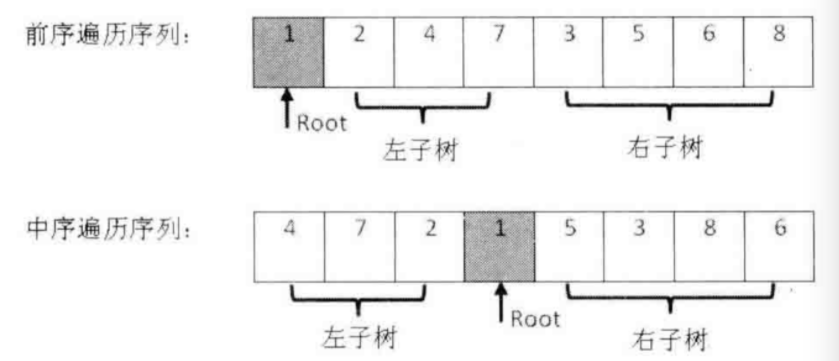

# 数据结构与算法（一） 二叉树遍历和重建二叉树

## 1 二叉树遍历★★★★★

**二叉树遍历是重点中的重点，需要掌握递归版本和非递归版本，同时掌握机写和手写。真正考察基本功的是非递归版本**。

### 1.1 二叉树中序遍历

二叉树的中序遍历，即以左中右的顺序依次遍历数据元素。

#### 题目

给定一个二叉树，返回它的**中序**遍历。

示例：

```js
输入: [1,null,2,3]
   1
    \
     2
    /
   3
输出: [1,3,2]
```

#### 代码

##### 递归实现

递归有两种写法，递归函数本身、在闭包中递归。

```js
var inorderTraversal = function(root , array = []){
    //如果根节点不为空
    if(root){
        //对左节点遍历
        inorderTraversal(root.left,array);
        array.push(root.val);
        //对右节点遍历
        inorderTraversal(root.right,array);
    }
    return array;
}
```

**复杂度分析：**

时间复杂度：O(n)


##### 非递归实现(迭代方法)

初始化一个栈和结果数组，当栈不为空或目标节点不为空时，重复下面的步骤：

1. 根节点和左节点入栈 →直至没有左孩子
2. 栈顶元素出栈，存入结果数组，将出栈元素作为根节点
3. 以右孩子为目标节点，执行1、2、3

```js
var inorderTraversal = function(root){
    var result= [];
    var stack = [];
    var current = root;
    while(stack.length >0 || current){
        while(current){
            stack.push(current);
            current = current.left;
        }
        current = stack.pop();
        result.push(current);
        current = current.right;
    }
    return result;
}
```

### 1.2 二叉树前序遍历

所谓前序遍历，即按照中左右的顺序进行遍历。

#### 题目

给定一个二叉树，返回它的**前序**遍历。

示例：

```js
输入: [1,null,2,3]  
   1
    \
     2
    /
   3 
输出: [1,2,3]
```

#### 代码

##### 递归算法

```js
var preorderTraversal = function(root , array = []){
    if(root){
        array.push(root.val);
        preorderTraversal(root.left,array);
        preorderTraversal(root.right,array);
    }
    return array;
}
```

##### 非递归实现

初始化一个栈和结果数组，当栈不为空或根节点不为空时，重复下面的步骤：

1. 目标节点存入结果数组，左孩子入栈  → 直至左孩子为空
2. 栈顶元素出栈，以栈顶元素为根节点
3. 以右孩子为目标节点，执行1、 2、 3

```js
var preorderTraversal = function(root){
    const result = [];
    const stack = [];
    let current = root;
    while(stack.length > 0 || current){
        while(current){
            result.push(current.val);
            stack.push(current);
            current = current.left;
        }
        current = stack.pop();
        current = current.right;
    }
    return result;
}
```

### 1.3 二叉树后序遍历

所谓后续遍历，即按照左右中的顺序进行遍历。

#### 题目

给定一个二叉树，返回它的**后序**遍历。

示例：

```js
输入: [1,null,2,3]  
   1
    \
     2
    /
   3 
输出: [3,2,1]
```

#### 代码

##### 递归算法

```js
var postorderTraversal = function(root , array = []){
    if(root){
        postorderTraversal(root.left , array);
        postorderTraversal(root.right , array);
        array.push(root.val);
    }
    return array;
}
```

##### 非递归算法

初始化一个栈、结果数组和记录上次访问节点的变量，当栈不为空或根节点不为空时，重复下面的步骤：

1. 将左孩子入栈 → 直至左孩子为空
2. 栈顶节点的右节点为空或被访问过 → 节点出栈，存入结果数组，标记为已访问，继续出栈查找。
3. 栈顶节点的右节点不为空且未被访问 ，以右孩子为目标节点，执行1 、2 、3

```js
var postorderTraversal = function (root) {
  const result = [];
  const stack = [];
  var last = null; //标记上一个访问的节点
  let current = root;
  while (stack.length > 0 || current) {
    while (current) {
      stack.push(current);
      current = current.left;
    }
    current = stack[stack.length - 1];
    if (!current.right || current.right == last) {
      current = stack.pop();
      result.push(current.val);
      last = current;
      current = null;
    } else {
      current = current.right;
    }
  }
  return result;
}
```

### 1.4 重建二叉树

**逆向思维，根据前序、中序遍历的特点重建二叉树。**

#### 题目1-二叉树重建

输入某二叉树的前序遍历和中序遍历的结果，请重建出该二叉树。假设输入的前序遍历和中序遍历的结果中都不含重复的数字。

例如输入前序遍历序列`{1,2,4,7,3,5,6,8}`和中序遍历序列`{4,7,2,1,5,3,8,6}`，则重建二叉树并返回。

##### 思路

- 前序遍历：根节点  + 左孩子 + 右孩子
- 中序遍历：左孩子 + 根节点 + 右孩子
- 后序遍历：左孩子 + 右孩子 + 根节点

故我们可以得出以下规律：

1. 从前序遍历中找到根节点root
2. 在中序遍历中查找root的位置index，即可获取左右子树的长度
3. 截取左子树的前序遍历、右子树的前序遍历
4. 截取左子树的中序遍历、右子树的中序遍历
5. 递归重建二叉树 分别获得左右子树。
6. 利用根节点和左右子树即可重建二叉树。



```js
function reConstructBinaryTree(pre, inorder) {
  if (pre.length === 0) {
    return null;
  }
  if (pre.length === 1) {
    return new TreeNode(pre[0]);
  }
  const root = pre[0];
  const index = inorder.indexOf(root);
  // 分割前序遍历
  const preLeft = pre.slice(1, index+1);
  const preRight = pre.slice(index + 1);
  //分割中序遍历
  const inorderLeft = inorder.slice(0, index);
  const inorderRight = inorder.slice(index + 1);
  //分别求解左右子树并生成二叉树
  const node = new TreeNode(root);
  node.left = reConstructBinaryTree(preLeft, inorderLeft);
  node.right = reConstructBinaryTree(preRight, inorderRight);
  return node;
}
```

#### 题目2-给前中遍历，求后序遍历。

给定一棵二叉树的前序遍历和中序遍历，求其后序遍历

输入描述:

两个字符串，其长度n均小于等于26。 第一行为前序遍历，第二行为中序遍历。 二叉树中的结点名称以大写字母表示：A，B，C....最多26个结点。

输出描述:

输入样例可能有多组，对于每组测试样例， 输出一行，为后序遍历的字符串。

样例：

```text
输入
ABC
BAC
FDXEAG
XDEFAG

输出
BCA
XEDGAF
```

##### 思路

本题一共有两种思路：

1. 重建二叉树后进行后序遍历。
2. 递归拼接二叉树的后序遍历。★★★★★推荐

第一种思路，常规思路，比较繁琐，代码如下

```js
function getPostTraversal(pre, vin) {
  // 1、重构二叉树
  function reContructBinaryTree(pre, vin) {
    if (pre.length === 0) {
      return null;
    }
    if (pre.length === 1) {
      return new TreeNode(pre[0]);
    }
    const root = pre[0];
    const index = vin.indexOf(root);
    const preLeft = pre.substring(1, index+1);
    const preRight = pre.substring(index + 1);
    const vinLeft = vin.substring(0, index);
    const vinRight = vin.substring(index + 1);
    const node = new TreeNode(root);
    node.left = reContructBinaryTree(preLeft, vinLeft);
    node.right = reContructBinaryTree(preRight, vinRight);
    return node;
  }
  // 2、后序遍历
  function postorderTraversal(root) {
    const result = "";
    const stack = [];
    var last = null;
    let current = root;
    while (current || stack.length > 0) {
      while (current) {
        stack.push(current);
        current = current.left;
      }
      current = stack[stack.length - 1];
      if (!current.right || current.right == last) {
        current = stack.pop();
        result = result + current.val;
        last = current;
        current = null;
      } else {
        current = current.right;
      }
    }
    return result;
  }
  // 3、调用
  const mytree = reContructBinaryTree(pre, vin);
  const postResult = postorderTraversal(mytree);
  return postResult;
}
```

第二种思路，非常的简洁！！！代码如下：

```js
function getHRD(pre, vin) {
    if (!pre) {
        return '';
    }
    if (pre.length === 1) {
        return pre;
    }
    const head = pre[0];
    const splitIndex = vin.indexOf(head);
    const vinLeft = vin.substring(0, splitIndex);
    const vinRight = vin.substring(splitIndex + 1);
    const preLeft = pre.substring(1, splitIndex + 1);
    const preRight = pre.substring(splitIndex + 1);
    return getHRD(preLeft, vinLeft) + getHRD(preRight, vinRight) + head;
}
```

