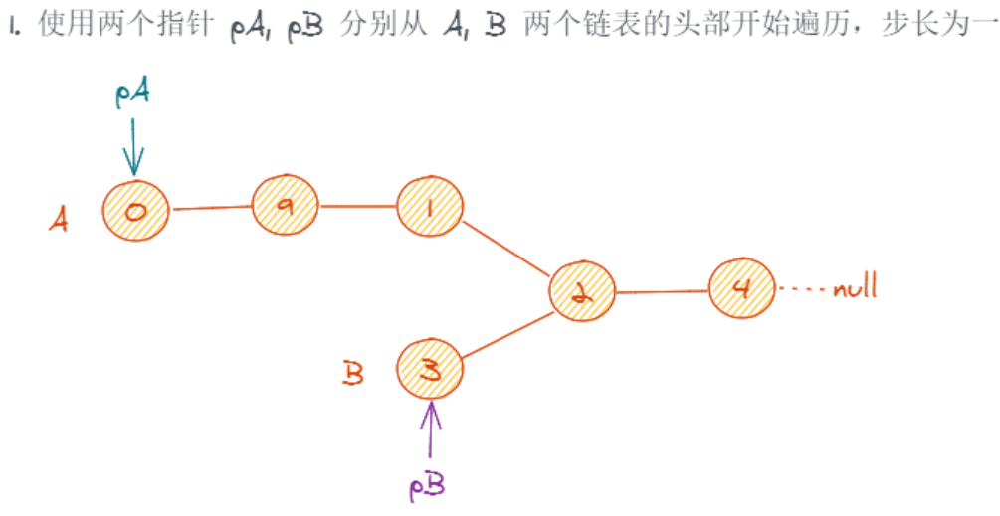
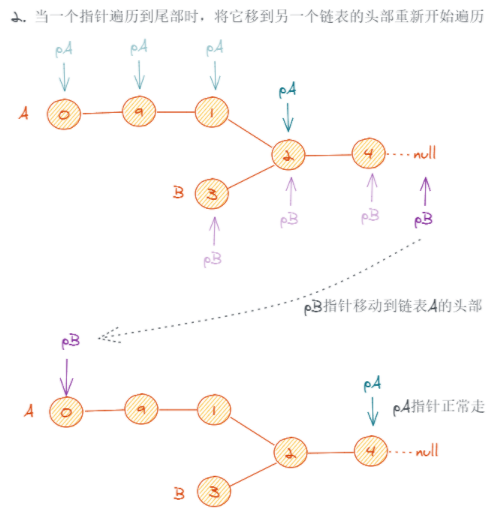
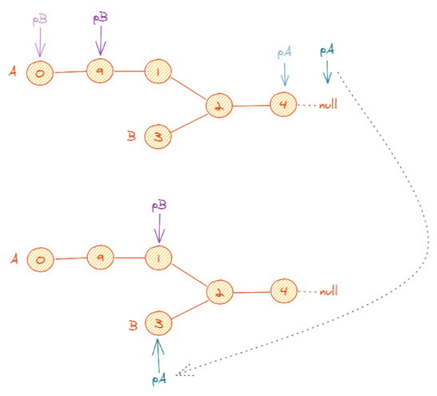
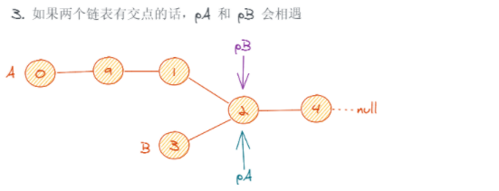
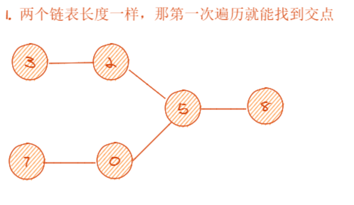
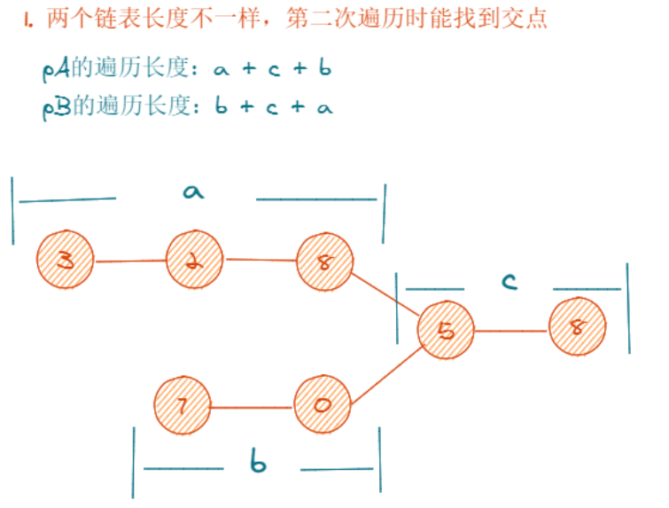
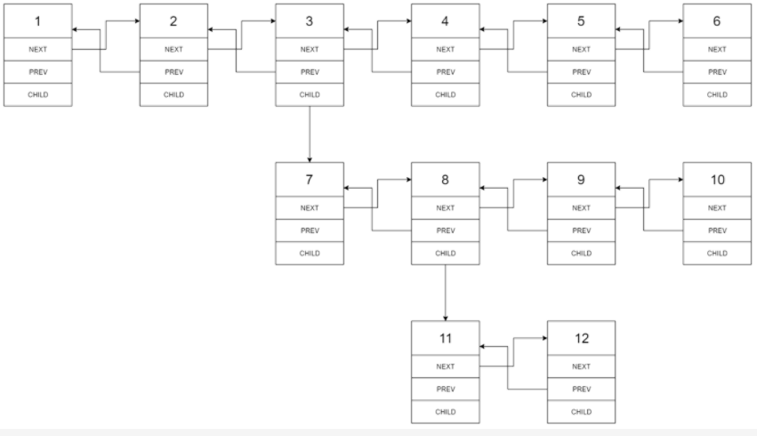

# 链表——双指针和双链表

## 1 双指针

> 双指针的思想在链表和数组中的题目都经常会用到，主要是利用两个或多个不同位置的指针，通过速度和方向的变换解决问题。

- 两个指针从不同位置出发：一个从始端开始，另一个从末端开始；
- 两个指针以不同速度移动：一个指针快一些，另一个指针慢一些。

对于单链表，因为我们只能在一个方向上遍历链表，所以第一种情景可能无法工作。然而，第二种情景，也被称为慢指针和快指针技巧，是非常有用的。

### 1.1 两个链表的第一个公共节点

剑指Offer52

#### 题目

输入两个链表，找出它们的第一个公共结点。

**程序尽量满足O(n)时间复杂度，且仅用O(1)内存**

示例 1：


```
输入：intersectVal = 8, listA = [4,1,8,4,5], listB = [5,0,1,8,4,5], skipA = 2, skipB = 3
输出：Reference of the node with value = 8
输入解释：相交节点的值为 8 （注意，如果两个列表相交则不能为 0）。从各自的表头开始算起，链表 A 为 [4,1,8,4,5]，链表 B 为 [5,0,1,8,4,5]。在 A 中，相交节点前有 2 个节点；在 B 中，相交节点前有 3 个节点。
```

#### 思路

快慢指针法

- 1.先找到两个链表的长度`length1`、`length2`
- 2.让长一点的链表先走`length2-length1`步，让长链表和短链表起点相同
- 3.两个链表一起前进，比较获得第一个相等的节点
- 时间复杂度`O(length1+length2)` 空间复杂度`O(0)`


#### 代码

```js
var getIntersectionNode = function (headA, headB) {
  if (!headA || !headB) return null;
  var lengthA = getLength(headA);
  var lengthB = getLength(headB);
  var long, short, distance;
  if (lengthA > lengthB) {
    long = headA;
    short = headB;
    distance = lengthA - lengthB;
  } else {
    long = headB;
    short = headA;
    distance = lengthB - lengthA;
  }

  // 长的移动位置
  while (distance--) {
    long = long.next;
  }

  //一起走
  while (long && short) {
    if (long === short) {
      return long;
    }
    long = long.next;
    short = short.next;
  }
  return null;
};

function getLength(head) {
  let count = 0;
  let current = head;
  while (current) {
    count++;
    current = current.next;
  }
  return count;
}
```


### 1.2 链表倒数第k个节点

Offer22

#### 题目

输入一个链表，输出该链表中倒数第k个节点。为了符合大多数人的习惯，本题从1开始计数，即链表的尾节点是倒数第1个节点。例如，一个链表有6个节点，从头节点开始，它们的值依次是1、2、3、4、5、6。这个链表的倒数第3个节点是值为4的节点。

#### 思路

简单思路： 循环到链表末尾找到 length 在找到length-k节点 需要循环两次。

优化：

设定两个节点，间距相差k个节点，当前面的节点到达终点，取后面的节点。

前面的节点到达k后，后面的节点才出发。

特判： 需要考虑head为null，k为0，k大于链表长度的情况。

#### 代码

```js
var getKthFromEnd = function (head, k) {
  //如果链表为空 或 k=0
  if (!head || !k) return null;
  var front = head;
  var behind = head;
  //记录链表长度
  var index = 1;
  while (front.next) {
    index++;
    front = front.next;
	//如果前面指针走过长度>k 后面指针开始移动
    if (index > k) {
      behind = behind.next;
    }
  }
  return (index >= k) && behind;

};

```


### 1.3 相交链表

leetcode 160

#### 题目

编写一个程序，找到两个单链表相交的起始节点。

如下面的两个链表：


在节点 c1 开始相交。

**示例 1：**


```j
 输入：intersectVal = 8, listA = [4,1,8,4,5], listB = [5,0,1,8,4,5], skipA = 2, skipB = 3
输出：Reference of the node with value = 8
输入解释：相交节点的值为 8 （注意，如果两个链表相交则不能为 0）。从各自的表头开始算起，链表 A 为 [4,1,8,4,5]，链表 B 为 [5,0,1,8,4,5]。在 A 中，相交节点前有 2 个节点；在 B 中，相交节点前有 3 个节点。
```

#### 思路

##### 1.暴力法

对于链表 A 的每个节点，都去链表 B 中遍历一遍找看看有没有相同的节点。

**复杂度**

- 时间复杂度：O(M * N)*O*(*M*∗*N*), M, N 分别为两个链表的长度。
- 空间复杂度：O(1)*O*(1)。

##### 2. 哈希表

- 先遍历一遍链表 A，用哈希表把每个节点都记录下来(注意要存节点引用而不是节点值)。
- 再去遍历链表 B，找到在哈希表中出现过的节点即为两个链表的交点。

**复杂度**

- 时间复杂度：O(M + N)*O*(*M*+*N*), M, N 分别为两个链表的长度。
- 空间复杂度：O(N)*O*(*N*)，N 为链表 A 的长度。

##### 3.双指针









**如果链表有交点**





**如果链表没有交点**

两个链表长度一样，第一次遍历结束后 pA 和 pB 都是 null，结束遍历
两个链表长度不一样，两次遍历结束后 pA 和 pB 都是 null，结束遍历

**复杂度**

- 时间复杂度：O(M + N)*O*(*M*+*N*), M, N 分别为两个链表的长度。
- 空间复杂度：O(1)*O*(1)。

#### 代码

##### 1.暴力法

```js
var getIntersectionNode = function (headA, headB) {
    if (!headA || !headB) return null;

    let pA = headA;
    while (pA) {
        let pB = headB;

        while (pB) {
            if (pA === pB) return pA;
            pB = pB.next;
        }

        pA = pA.next;
    }
};
```


##### 2.哈希表

```js
var getIntersectionNode = function (headA, headB) {
  if (!headA && !headB) {
    return null;
  }

  const hashmap = new Map();
  let pA = headA;
  while (pA) {
    hashmap.set(pA, 1);
    pA = pA.next;
  }

  let pB = headB;
  while (pB) {
    if (hashmap.has(pB)) return pB;
    pB = pB.next;
  }
}
```


##### 3.双指针

```js
var getIntersectionNode = function (headA, headB) {
  if (!headA && !headB) {
    return null;
  }

  let pA = headA;
  let pB = headB;
  while (pA !== pB) {
    pA = pA === null ? headB : pA.next;
    pB = pB === null ? headA : pB.next;
  }
  return pA;
}
```


快慢指针法（两个链表的第一个公共节点的方法）

```js
var getIntersectionNode = function (headA, headB) {
  if (!headA || !headB) return null;
  var lengthA = getLength(headA);
  var lengthB = getLength(headB);
  var long, short, distance;
  if (lengthA > lengthB) {
    long = headA;
    short = headB;
    distance = lengthA - lengthB;
  } else {
    long = headB;
    short = headA;
    distance = lengthB - lengthA;
  }

  // 长的移动位置
  while (distance--) {
    long = long.next;
  }

  //一起走
  while (long && short) {
    if (long === short) {
      return long;
    }
    long = long.next;
    short = short.next;
  }
  return null;
};

function getLength(head) {
  let count = 0;
  let current = head;
  while (current) {
    count++;
    current = current.next;
  }
  return count;
}
```


## 2 双向链表

> 双链还有一个引用字段，称为`prev`字段。有了这个额外的字段，您就能够知道当前结点的前一个结点。

### 2.1 扁平化多级双向链表

#### 题目

多级双向链表中，除了指向下一个节点和前一个节点指针之外，它还有一个子链表指针，可能指向单独的双向链表。这些子列表也可能会有一个或多个自己的子项，依此类推，生成多级数据结构，如下面的示例所示。

给你位于列表第一级的头节点，请你扁平化列表，使所有结点出现在单级双链表中。

**示例 1：**

```
输入：head =[1,2,3,4,5,6,null,null,null,7,8,9,10,null,null,11,12]
输出：[1,2,3,7,8,11,12,9,10,4,5,6]
```

解释：
输入的多级列表如下图所示：



扁平化后的链表如下图：


**如何表示测试用例中的多级链表？**

以 **示例 1** 为例：

```js
 1---2---3---4---5---6--NULL
         |
         7---8---9---10--NULL
             |
             11--12--NULL
```

序列化其中的每一级之后：

```js
[1,2,3,4,5,6,null]
[7,8,9,10,null]
[11,12,null]
```

为了将每一级都序列化到一起，我们需要每一级中添加值为 null 的元素，以表示没有节点连接到上一级的上级节点。

```js
[1,2,3,4,5,6,null]
[null,null,7,8,9,10,null]
[null,11,12,null]
```

合并所有序列化结果，并去除末尾的 null 。

```js
[1,2,3,4,5,6,null,null,null,7,8,9,10,null,null,11,12]
```

### 思路

- 遇到child就递归, 把next和child都传递过去, 因为指针会遍历到后面, 正好可以拼接next和child
- 递归返回之后要清掉child, 并且处理好prev指针

### 代码

```js
// 优化前
const flatten = (head, next) => {
  let curr = head
  while (curr && (curr.next || curr.child)) {
    if (curr.child) {
      curr.next = flatten(curr.child, curr.next)
      curr.child = null
      curr.next.prev = curr
    }
    curr = curr.next
  }
  if (next) {
    next.prev = curr
    curr.next = next
  }
  return head
}
```

