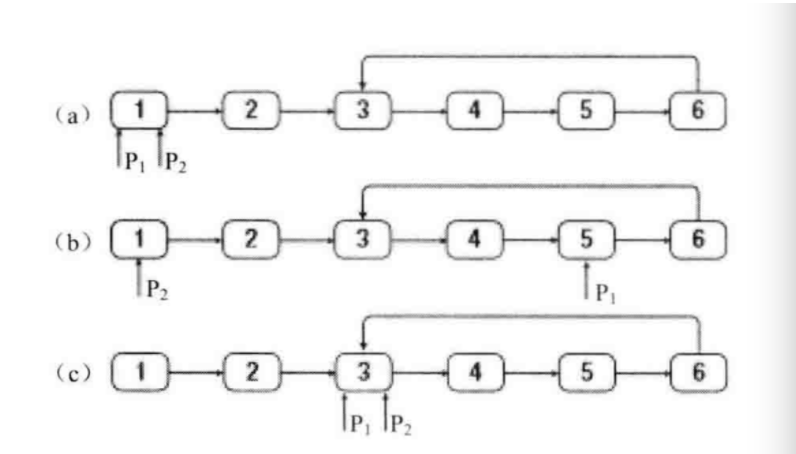
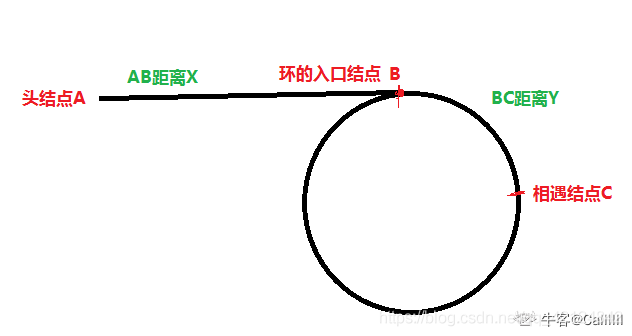
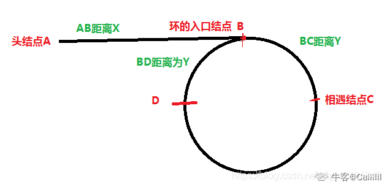

# 链表环类题目

> 环类题目即从判断一个单链表是否存在循环而扩展衍生的问题

## 1 环形链表

给定一个链表，判断链表中是否有环。

如果链表中有某个节点，可以通过连续跟踪 next 指针再次到达，则链表中存在环。 为了表示给定链表中的环，我们使用整数 pos 来表示链表尾连接到链表中的位置（索引从 0 开始）。 如果 pos 是 -1，则在该链表中没有环。注意：pos 不作为参数进行传递，仅仅是为了标识链表的实际情况。

如果链表中存在环，则返回 true 。 否则，返回 false 。

### 题解

慢指针一次走一步，快指针一次走两步，快指针追上慢指针，说明有环

举例：400m 操场，小明一次跑 2 米，小梁一次跑 1 米，小梁跑一圈（400m）后小明（800m）追上小梁

```js
const hasCycle = (head) => {

  // 至少 2 个节点才能构成一个环
  if (!head || !head.next) {
    return false;
  }

  // 设置快慢指针
  let slow = head;
  let fast = head.next;

  // 如果快指针一直没有追上慢指针
  while (slow !== fast) {
    // 如果没有环，则快指针会抵达终点
    if (!fast || !fast.next) {
      return false;
    }
    slow = slow.next;
    fast = fast.next.next;
  }

  // 如果有环，那么快指针会追上慢指针
  return true;
};

```

## 2 链表环的入口节点

### 题目

给一个链表，若其中包含环，请找出该链表的环的入口结点，否则，输出null。

### 思路

快慢指针法，声明两个指针 P1 P2

- 1.判断链表是否有环： P1 P2 从头部出发，P1走两步，P2走一步，如果可以相遇，则环存在
- 2.从环内某个节点开始计数，再回到此节点时得到链表环的长度 length
- 3.P1、P2 回到head节点，让 P1 先走 length 步 ，当P2和P1相遇时即为链表环的起点



关于思路3的理解：

这一张图告诉我们，对于快慢指针，当slow和fast相遇时，相遇点在C,	同时推导出 =>2(AB+BC) = AB+BC+CB+BC	=> AB = CB



第二张图告诉我们，当slow走到入口节点B的时候，fast走到D,也就是说 => 2AB = AB+BC+CD =>AB = BC+CD
结合上图的结论  AB = CB	则可以推导出 => CB = BC+CD =>CD+DB = BC+CD => DB=BC	也就是为什么 BC,BD两个距离都是Y

所以根据 X,Y 距离的设置  结合之前的关系（AB = CB） 推导出 => CD = X-Y,CDB=X
然后，当slow和fast在C点相遇后，让slow指针的位置不变，也就是指向C,更改fast指针的指向为pHead,两个指针每次都走一步，下一次相遇就是入口节点



### 代码

```js
function EntryNodeOfLoop(pHead) {
    if (!pHead || !pHead.next) {
        return null;
    }
    let P1 = pHead.next;
    let P2 = pHead.next.next;
    // 1.判断是否有环
    while (P1 != P2) {
        //p2走到终点，说明没有环
        if (P2 === null || P2.next === null) {
            return null;
        }
        P1 = P1.next;
        P2 = P2.next.next;
    }
    // 2.获取环的长度
    let temp = P1;
    let length = 1;
    P1 = P1.next;
    while (temp != P1) {
        P1 = P1.next;
        length++;
    }
    // 3.找公共节点
    P1 = P2 = pHead;
    // p2先走length步
    while (length-- > 0) {
        P2 = P2.next;
    }
    // p1 p2 一起走直至相遇
    while (P1 != P2) {
        P1 = P1.next;
        P2 = P2.next;
    }
    return P1;
}
```

## 3 约瑟夫环

#### 题目

`0,1,...,n-1`这`n`个数字排成一个圆圈，从数字0开始，每次从这个圆圈里删除第`m`个数字。求出这个圆圈里剩下的最后一个数字。

其实这就是著名的约瑟夫环问题

#### 思路

**解法1:用链表模拟环**

- 用链表模拟一个环
- 模拟游戏场景
- 记录头节点的前一个节点`current`，以保证我们找到的要删除的节点是`current.next`
- 每次循环m次找到目标节点删除，直到链表只剩下一个节点
- 时间复杂度`O(m*n)` 空间复杂度`O(n)`

**解法2:用数组模拟**

- 每次计算下标，需要考虑末尾条件

**解法3:数学推导**

- `f(n) = (f(n-1)+m)%n` 即 `f(n,m) = (f(n-1,m)+m)%n`
- 使用递归求解 边界条件为 `n=1`

时间复杂度 `1>2>3`

易理解程度 `1>2>3`

### 代码

```js
// 解法1
function LastRemaining_Solution(n, m) {
    //如果数量、次数小于1 
    if (n < 1 || m < 1) {
        return -1;
    }
    //头指针指向第一个数字
    const head = { val: 0 }
	//模拟环
    let current = head;
    for (let i = 1; i < n; i++) {
        current.next = { val: i }
        current = current.next;
    }
    //尾部指向头节点
    current.next = head;
	//当环中的数量>1时进行循环
    while (current.next != current) {
        //循环找删除的节点
        for (let i = 0; i < m - 1; i++) {
            current = current.next;
        }
        //跨过删除节点
        current.next = current.next.next;
    }
    return current.val;
}
```

```js
// 解法2
function LastRemaining_Solution(n, m) {
    if (n < 1 || m < 1) {
        return -1;
    }
    const array = [];
    let index = 0;
    for (let i = 0; i < n; i++) {
        array[i] = i;
    }
    //长度>1时循环
    while (array.length > 1) {
        //计算删除节点的坐标
        index = (index + m) % array.length - 1;
        if (index >= 0) {
            //从Index坐标开始删除一个元素
            array.splice(index, 1);
        } else {
            //如果index<0，删除末尾元素
            array.splice(array.length - 1, 1);
            //指向第一个数字
            index = 0;
        }
    }
    return array[0];
}
```

```  js
// 解法3
function LastRemaining_Solution(n, m) {
    if (n < 1 || m < 1) {
        return -1;
    } else {
        return joseoh(n, m);
    }

}

function joseoh(n, m) {
    //递归条件
    if (n === 1) {
        return 0;
    }
    //等价表达式
    return (joseoh(n - 1, m) + m) % n;
}
```